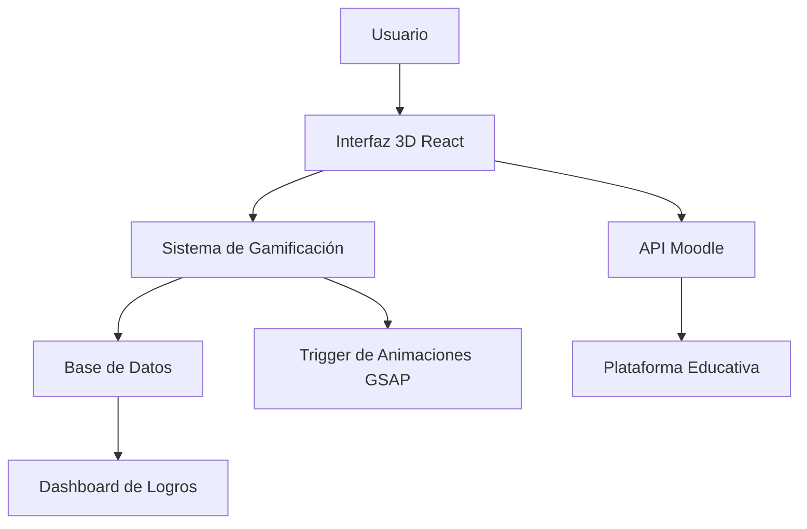

# 🎓 Teleplataforma - Sistema de Gamificación Educativa

**Sistema de gamificación completo para la teleplataforma Moodle de la Fundación San Ezequiel Moreno**  
*Desarrollado desde cero.*

---

## 🎯 Descripción del Proyecto

Una **landing page externa de gamificación** que combina una interfaz 3D inmersiva con un sistema de gamificación robusto, diseñada para complementar y gamificar la experiencia de aprendizaje en la plataforma Moodle existente de la Fundación San Ezequiel Moreno.

### ✨ Características Principales

<table>
<tr>
<td width="50%">

#### 🎮 **Interfaz 3D Inmersiva**
- Navegación mediante drag & drop
- Física realista
- Render optimizado con Three.js

#### 🏆 **Sistema de Gamificación**
- Experiencia, niveles y logros
- Animaciones 8-bit style
- Dashboard pixelart interactivo

</td>
<td width="50%">

#### 📚 **Integraciones**
- Sincronizado con Moodle
- Base de datos externa para la gamificación y permanencia de datos
- Sistema de autenticación integrado con validación bidireccional

#### 🎨 **Diseño Moderno**
- Glassmorphism y animaciones fluidas
- Responsive design
- Optimización de performance

</td>
</tr>
</table>

---

## 🚀 Funcionalidades Implementadas

### ✅ **Completado**

- [x] **Interfaz 3D Interactiva** - Navegación con física realista
- [x] **Sistema de Autenticación** - Integración completa con Moodle
- [x] **Dashboard de Gamificación** - Interfaz pixelart con animaciones
- [x] **Sincronización de Datos** - Moodle ↔ Database en tiempo real
- [x] **Sistema de Migraciones** - Automatización de cambios de DB
- [x] **Responsive Design** - Optimizado a todos los dispositivos
- [x] **Animaciones Avanzadas** - GSAP para transiciones cinematográficas

### 🔄 **En Desarrollo**

- [ ] **Sistema de Items** - Stash y Recompensas
- [ ] **Leaderboard Global** - Rankings
- [ ] **Sistema de Misiones** - Objetivos dinámicos
- [ ] **Analytics Avanzados** - Métricas de aprendizaje

---

## 🎮 Sistema de Gamificación

### 🏆 **Características Implementadas**

- ✅ **Permanencia de datos** - Los puntos de experiencia son permanentes entre sesiones
- ✅ **Cálculo dinámico** - Basado en progreso real de cursos del estudiante
- ✅ **Sistema de EXP** - Fórmula matemática para escalado incremental
- ✅ **Animaciones retro** - Efectos visuales estilo 8-bits
- ✅ **Dashboard interactivo** - Interfaz pixelart con animaciones
- ✅ **Sincronización en tiempo real** - Integración completa con Moodle

---

## 🏗️ Arquitectura del Sistema

### 🛠️ Stack Tecnológico

| **Frontend** | **Backend** | **Integración** |
|:------------:|:-----------:|:---------------:|
| React 18.2.0 | Secret:) | Moodle API |
| TypeScript | PostgreSQL | Web Services |
| Three.js | Migraciones | Autenticación |
| GSAP | Triggers | Sincronización |
| TailwindCSS | Funciones | Validación |

### 📊 **Métricas del Proyecto**

| **Métrica** | **Valor** |
|:-----------:|:---------:|
| 📝 Líneas de código | 2,500+ |
| 🧩 Componentes React | 15+ |
| 🗄️ Migraciones SQL | 6 |
| 🔗 APIs | 2 |
| 🛠️ Tecnologías | 8+ |

---

## 🎯 Casos de Uso

### 👨‍🎓 **Para Estudiantes**
1. **Acceso intuitivo** desde la plataforma Moodle existente
2. **Navegación 3D** mediante drag & drop de tarjetas
3. **Gamificación del aprendizaje y engagement** con puntos y niveles
4. **Progreso visual** con animaciones retro gaming
5. **Experiencia inmersiva** que motiva el aprendizaje

### 👨‍💼 **Para Administradores**
- **Métricas detalladas** de progreso estudiantil
- **Integración transparente** con Moodle existente
- **Dashboard administrativo** para monitoreo
- **Sistema de respaldos** automatizado

---

## 🏆 Logros Técnicos

### 🎯 **Desafíos Superados**

| **Desafío** | **Solución Implementada** |
|:-----------:|:-------------------------:|
| 🔄 **Integración compleja** | Conexión bidireccional entre Moodle y Database |
| 🎮 **Física realista** | Implementación de Rapier para interacciones 3D |
| ⚡ **Optimización** | Lazy loading y memoización avanzada |
| 🗄️ **Migraciones** | Automatización completa de cambios de BD |
| 🎨 **Animaciones** | GSAP para transiciones profesionales |

---

## 🎨 Identidad Visual

| **Elemento** | **Especificación** |
|:------------:|:-----------------:|
| 🎨 **Color principal** | `#5d0008` (Borgoña corporativo) |
| ⚪ **Fondo** | Blanco puro |
| ✨ **Efectos** | Glassmorphism |
| 🎮 **Estilo gaming** | Pixelart retro |

---

## 📱 Responsive Design

| **Dispositivo** | **Optimización** |
|:---------------:|:----------------:|
| 📱 **Móvil** | Interfaz adaptativa con touch |
| 💻 **Tablet** | Layout híbrido |
| 🖥️ **Desktop** | Experiencia 3D |
| 📺 **Pantallas grandes** | Escalado automático |

---

## 🤝 Contribución

Este proyecto es desarrollado por el equipo de Sistemas de la **Fundación San Ezequiel Moreno**. 

Para consultas sobre el proyecto, contactar con el equipo de desarrollo.

---

## 📄 Licencia

Copyright (c) 2025 Fundación San Ezequiel Moreno. Todos los derechos reservados.

---

### 🚀 **Estado del Proyecto**

**Desarrollado por**: Fundación San Ezequiel Moreno - Sistemas: **David Conde Gutierrez.**

